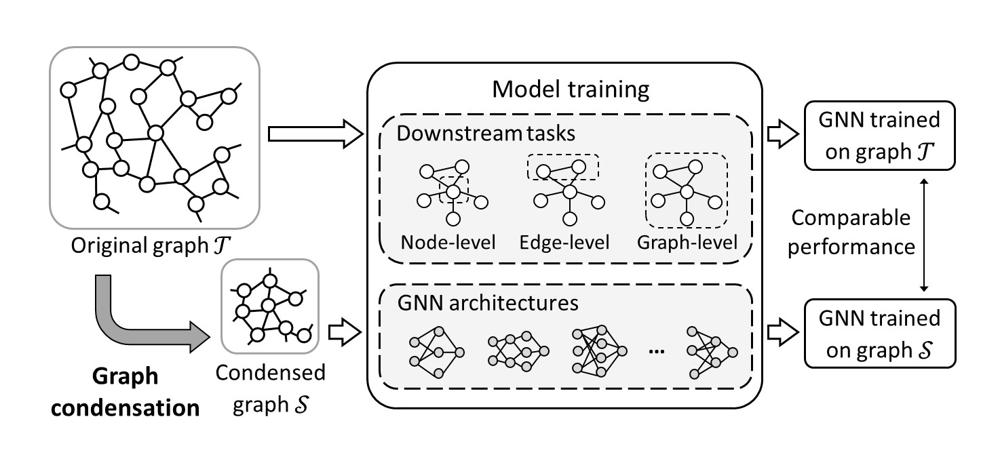

# Graph Condensation Papers 

[](https://github.com/sindresorhus/awesome)
 


**Graph condensation** (GC) is a data-centric approach that accelerates GNN model training by creating a compact yet representative graph to replace the original graph. It enables GNNs trained on the condensed graph to match the performance of those trained on the original graph.

<p align="center">

</p>


This repository aims to provide a comprehensive resource for researchers and practitioners interested in exploring various aspects of graph condensation.

For a detailed overview of graph condensation techniques and their applications, we recommend reading our survey paper: 🔥[Graph Condensation: A Survey](https://arxiv.org/abs/2401.11720v2). This survey paper serves as an excellent starting point for understanding the fundamentals of graph condensation and exploring its diverse applications.


## Latest Updates
[05/09/2024] [GSTAM: Efficient Graph Distillation with Structural Attention-Matching](https://arxiv.org/abs/2408.16871) (Arash Rasti-Meymandi et al. ECCV'24)  
[28/08/2024] [Self-Supervised Learning for Graph Dataset Condensation](https://dl.acm.org/doi/10.1145/3637528.3671682) (Yuxiang Wang et al. KDD'24)  
[31/07/2024] [Backdoor Graph Condensation](https://arxiv.org/abs/2407.11025) (Jiahao Wu et al. Arxiv'24)  
[20/07/2024] [TinyGraph: Joint Feature and Node Condensation for Graph Neural Networks](https://arxiv.org/abs/2407.08064) (Yezi Liu et al. Arxiv'24)


## Contribution
We welcome contributions to enhance the breadth and depth of this repository. If you have a paper related to graph condensation that you believe should be included, please feel free to submit a pull request. Together, we can build a valuable resource for the graph condensation community.
```
| conference/journal'year | [paper_name](paper_link) | Authors | [[code]](code_link) |
```


***
## Contents
The repository is organized into categories to facilitate easy navigation and exploration of papers related to graph condensation, including effectiveness, efficiency, generalization, fairness and applications.


- [Graph Condensation Papers](#graph-condensation-papers)
  - [Latest Updates](#latest-updates)
  - [Contribution](#contribution)
  - [Contents](#contents)
  - [Survey](#survey)
  - [Methodology](#methodology)
    - [Effective Graph Condensation](#effective-graph-condensation)
    - [Efficient Graph Condensation](#efficient-graph-condensation)
    - [Generalized Graph Condensation](#generalized-graph-condensation)
    - [Fair Graph Condensation](#fair-graph-condensation)
    - [Robust Graph Condensation](#robust-graph-condensation)
  - [Applications](#applications)
    - [Graph Continual Learning](#graph-continual-learning)
    - [Hyper-Parameter/Neural Architecture Search](#hyper-parameterneural-architecture-search)
    - [Federated Learning](#federated-learning)
    - [Inference Acceleration](#inference-acceleration)
    - [Heterogeneous Graph](#heterogeneous-graph)
    - [Backdoor Attack](#backdoor-attack)
  - [Open-Source Libraries](#open-source-libraries)
  - [Related Repositories](#related-repositories)
  - [Contact](#contact)


***
## Survey

| | | | 
|-|-|-|
| Arxiv'24 | [Graph Condensation: A Survey](https://arxiv.org/abs/2401.11720) | Xinyi Gao et al. |
| IJCAI'24 | [A Comprehensive Survey on Graph Reduction: Sparsification, Coarsening, and Condensation](https://arxiv.org/abs/2402.03358) | Mohammad Hashemi & Wei Jin et al. |
| Arxiv'24 | [A Survey on Graph Condensation](https://arxiv.org/abs/2402.02000) | Hongjia Xu et al. |


***
&nbsp;
## Methodology

### Effective Graph Condensation

| | | | | |
|-|-|-|-|-|
| ICLR'22| GCond | [Graph Condensation for Graph Neural Networks](https://arxiv.org/abs/2110.07580) | Wei Jin et al. | [[code]](https://github.com/chandlerbang/gcond) |
| KBS'23| MSGC | [Multiple Sparse Graphs Condensation](https://www.sciencedirect.com/science/article/pii/S0950705123006548) | Jian Gao et al. | |
| NeurIPS'23| SFGC | [Structure-free Graph Condensation: From Large-scale Graphs to Condensed Graph-free Data](https://arxiv.org/abs/2306.02664) | Xin Zheng et al. | [[code]](https://github.com/amanda-zheng/sfgc) |
| Arxiv'23|GroC | [Attend Who is Weak: Enhancing Graph Condensation via Cross-Free Adversarial Training](https://arxiv.org/abs/2311.15772) | Xinglin Li et al. | |
| Arxiv'24| CTRL | [Two Trades is not Baffled: Condensing Graph via Crafting Rational Gradient Matching](https://arxiv.org/abs/2402.04924) | Tianle Zhang et al. | [[code]](https://github.com/nus-hpc-ai-lab/ctrl) |
| ICML'24| GEOM | [Navigating Complexity: Toward Lossless Graph Condensation via Expanding Window Matching](https://arxiv.org/abs/2402.05011) | Yuchen Zhang et al. | [[code]](https://github.com/nus-hpc-ai-lab/geom) |
| KDD'24| GCSR | [Graph Data Condensation via Self-expressive Graph Structure Reconstruction](https://arxiv.org/abs/2403.07294) | Zhanyu Liu et al. | [[code]](https://www.dropbox.com/scl/fi/2aonyp5ln5gisdqtjimu8/GCSR.zip?rlkey=11cuwfpsf54wxiiktu0klud0x&dl=0) |
| Arxiv'24| TinyGraph | [TinyGraph: Joint Feature and Node Condensation for Graph Neural Networks](https://arxiv.org/abs/2407.08064) | Yezi Liu et al. | |
| KDD'24| SGDC | [Self-Supervised Learning for Graph Dataset Condensation](https://dl.acm.org/doi/10.1145/3637528.3671682) | Yuxiang Wang et al. | [[code]](https://github.com/wyx11112/SGDC) |  
| ECCV'24| GSTAM | [GSTAM: Efficient Graph Distillation with Structural Attention-Matching](https://arxiv.org/abs/2408.16871) | Arash Rasti-Meymandi et al. | [[code]](https://github.com/arashrasti96/GSTAM) |  


### Efficient Graph Condensation

| | | | | |
|-|-|-|-|-|
| KDD'22 | DosCond | [Condensing Graphs via One-Step Gradient Matching](https://arxiv.org/abs/2206.07746) | Wei Jin et al. | [[code]](https://github.com/amazon-research/DosCond) |
| Arxiv'22 | GCDM | [Graph Condensation via Receptive Field Distribution Matching](https://arxiv.org/abs/2206.13697) | Mengyang Liu et al. | |
| KDD'23 | KIDD | [Kernel Ridge Regression-Based Graph Dataset Distillation](https://dl.acm.org/doi/10.1145/3580305.3599398) | Zhe Xu et al. | [[code]](https://github.com/pricexu/KIDD) |
| WWW'24 | GC-SNTK | [Fast Graph Condensation with Structure-based Neural Tangent Kernel](https://arxiv.org/abs/2310.11046) | Lin Wang et al. | |
| ICLR'24 | Mirage | [Mirage: Model-Agnostic Graph Distillation for Graph Classification](https://arxiv.org/abs/2310.09486) | Mridul Gupta et al. | [[code]](https://github.com/idea-iitd/Mirage) |
| Arxiv'24 | DisCo | [Disentangled Condensation for Large-scale Graphs](https://arxiv.org/abs/2401.12231) | Zhenbang Xiao et al. | [[code]](https://github.com/BangHonor/DisCo) |
| WWW'24 | EXGC | [EXGC: Bridging Efficiency and Explainability in Graph Condensation](https://arxiv.org/abs/2402.05962) | Junfeng Fang et al. | [[code]](https://github.com/MangoKiller/EXGC) |
| Arxiv'24 | SimGC | [Simple Graph Condensation](https://arxiv.org/abs/2403.14951) | Zhenbang Xiao et al. | |
| Arxiv'24 | CGC | [Rethinking and Accelerating Graph Condensation: A Training-Free Approach with Class Partition](https://arxiv.org/abs/2405.13707) | Xinyi Gao et al. | |


### Generalized Graph Condensation

| | | | | |
|-|-|-|-|-|
| NeurIPS'23| SGDD| [Does Graph Distillation See Like Vision Dataset Counterpart?](https://arxiv.org/abs/2310.09192) | Beining Yang et al. | [[code]](https://github.com/RingBDStack/SGDD) |
| ICML'24 | GCEM| [Graph Condensation via Eigenbasis Matching](https://arxiv.org/abs/2310.09202) | Yang Liu et al. | |
| KDD'24 | OpenGC | [Graph Condensation for Open-World Graph Learning](https://arxiv.org/abs/2405.17003) | Xinyi Gao et al. | |

### Fair Graph Condensation

| | | | |
|-|-|-|-|
| NeurIPS'23| FGD| [Fair Graph Distillation](https://openreview.net/forum?id=xW0ayZxPWs) | Qizhang Feng et al. | 
| AS'23 | GCARe| [GCARe: Mitigating Subgroup Unfairness in Graph Condensation through Adversarial Regularization](https://www.mdpi.com/2076-3417/13/16/9166) | Runze Mao et al. | 

### Robust Graph Condensation

| | | | |
|-|-|-|-|
| Arxiv'24 | RobGC | [RobGC: Towards Robust Graph Condensation](https://arxiv.org/abs/2406.13200) | Xinyi Gao et al. |


***
&nbsp;
## Applications

### Graph Continual Learning

| | | | | |
|-|-|-|-|-|
| ICDM'23 | CaT | [CaT: Balanced Continual Graph Learning with Graph Condensation](https://arxiv.org/abs/2309.09455) | Yilun Liu et al. | [[code]](https://github.com/superallen13/CaT-CGL) |
| Arxiv'23 | PUMA | [PUMA: Efficient Continual Graph Learning with Graph Condensation](https://arxiv.org/abs/2312.14439) | Yilun Liu et al. | [[code]](https://github.com/superallen13/puma) |

### Hyper-Parameter/Neural Architecture Search

| | | | |
|-|-|-|-|
| Arxiv'23 |HCDC | [Faster Hyperparameter Search for GNNs via Calibrated Dataset Condensation](https://openreview.net/forum?id=ohQPU2G3r3C) | Mucong Ding et al. | 

### Federated Learning

| | | | |
|-|-|-|-|
| Arxiv'23 |FedGKD | [FedGKD: Unleashing the Power of Collaboration in Federated Graph Neural Networks](https://arxiv.org/abs/2309.09517) | Qiying Pan et al. |
| Arxiv'24 | FedGC | [Federated Graph Condensation with Information Bottleneck Principles](https://arxiv.org/abs/2405.03911) | Bo Yan | 

### Inference Acceleration

| | | | |
|-|-|-|-|
| ICDE'24 |MCond | [Graph Condensation for Inductive Node Representation Learning](https://arxiv.org/abs/2307.15967) | Xinyi Gao et al. | 

### Heterogeneous Graph

| | | | | |
|-|-|-|-|-|
| TKDE'24 |HGCond | [Heterogeneous Graph Condensation](https://ieeexplore.ieee.org/abstract/document/10423255) | Jian Gao et al. | [[code]](https://github.com/jianjianGJ/hgcond) |

### Backdoor Attack

| | | | |
|-|-|-|-|
| Arxiv'24 |BGC | [Backdoor Graph Condensation](https://arxiv.org/abs/2407.11025) | Jiahao Wu et al. |


***
&nbsp;
## Open-Source Libraries
| Library | Paper | Implementation | #GC Methods | #Datasets | Tasks |
|-|-|-|-|-|-|
| [GCondenser](https://github.com/superallen13/GCondenser)| [[paper]](https://arxiv.org/abs/2405.14246)| PyG, DGL | 6| 7| Node classification |
| [GC-Bench](https://github.com/RingBDStack/GC-Bench)| [[paper]](https://arxiv.org/abs/2407.00615)|PyG | 9 | 12 | Node classification, graph classification, link prediction, node clustering, anomaly detection |
| [GraphSlim](https://github.com/Emory-Melody/GraphSlim)| [[paper]](https://arxiv.org/abs/2406.16715)|PyG | 7| 5| Node classification | 


***
&nbsp;
## Related Repositories
In addition to this Graph Condensation Papers Repository, you may find the following related repositories valuable for your research and exploration:
+ [Awesome-graph-reduction](https://github.com/ChandlerBang/awesome-graph-reduction)
+ [Awesome-Graph-Condensation](https://github.com/Frostland12138/Awesome-Graph-Condensation)
+ [Awesome-Dataset-Distillation](https://github.com/Guang000/Awesome-Dataset-Distillation)


***
&nbsp;
## Contact
For any inquiries or suggestions regarding this repository, please don't hesitate to contact us by opening an issue on this repository.

Thank you for your interest in the Graph Condensation Papers Repository. We hope you find it valuable for your research and exploration. If you find this repository to be useful, please cite our survey paper.

```
@article{gao2024graph,
 title={Graph condensation: A survey},
 author={Gao, Xinyi and Yu, Junliang and Chen, Tong and Ye, Guanhua and Zhang, Wentao and Yin, Hongzhi},
 journal={arXiv preprint arXiv:2401.11720},
 year={2024}
}
```
